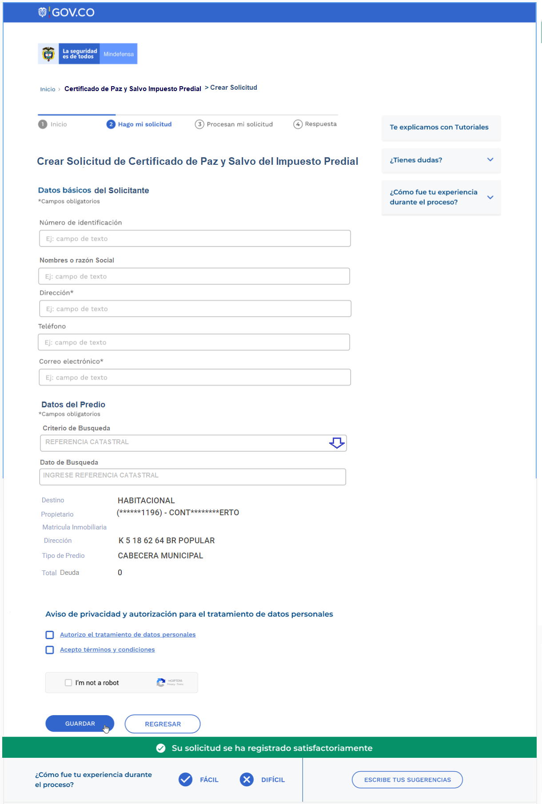

# Interfaces de usuario

<b>Inicio de solicitud</b>:
usuario publico entra a opcion de tramite que desea realizar o consultar, se le presenta informacion juridica del tramite y 2 opciones:

1. crear una nueva solicitud
2. consultar una solicitud existente

<b>Datos de solicitud</b>:
se requiere que el usuario suministre los datos de contacto y la data requerida por el tramite en particular que inicio; sera presentada y validada dependiendo a la estructura de cada tramite.

Ejemplo:
- <b>requiere:</b> referencia catastral de un predio a emitirle el paz y salvo
- <b>verifica:</b> predio de la referencia debe existir
- <b>verifica:</b> saldo de estado de cuenta para el predio debe estar en 0.
  
Si se cumplen  todas las condiciones entonces permite pasar a un siguiente paso el tramite.

ver

ver

ver

ver

ver

ver

ver

ver

