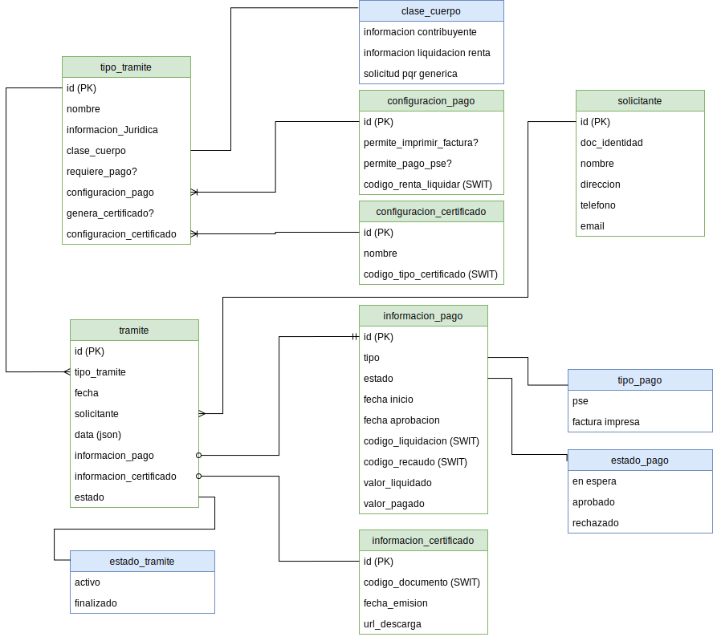

# SISTEMA DE TRAMITES

sistema externo a swit en el cual se pueden configurar tramites para ser realizados por usuarios publicos del portal tributario.

---

## Estructura

- se configuran los tipos de tramite y asociarian la configuracion de renta valida de swit para que este realice la liquidacion que aplique, ademas cual es el documento que generara como certificado o comprobante resultado.

- los solicitantes quedarian normalizados aun cuando se pida la informacion para cada solicitud

- toda la informacion necesaria para las busquedas por tramite debe quedar de este lado.

mostrar diagrama de entidad-relacion 

---

## Secuencia de Ejecucion

mostrar diagrama de secuencia 

---
## Diseño de GUI

[ver diseño de GUI](GUI.md)